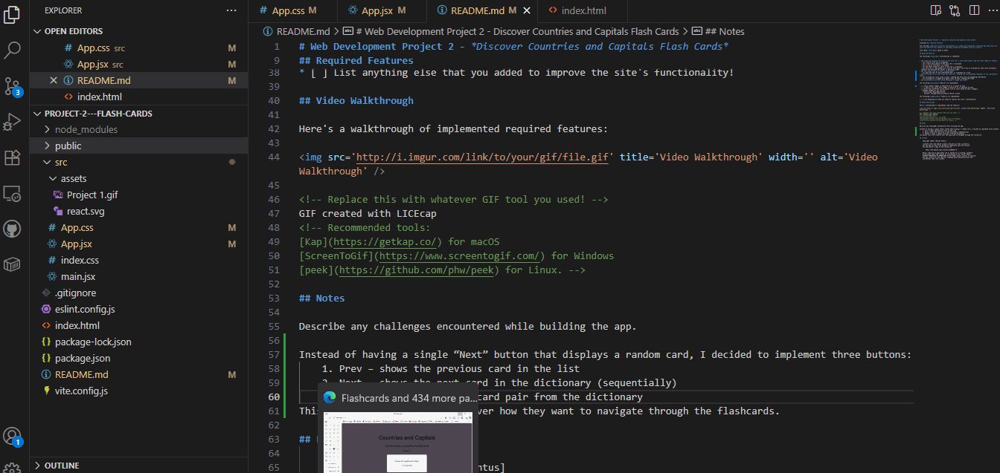

# Web Development Project 2 - *Discover Countries and Capitals Flash Cards*

Submitted by: **Mikita Puntus**

This web app: **Discover Countries and Capitals is a simple and interactive flashcard app that helps you learn and memorize the capitals of countries around the world—one card at a time.**

Time spent: **3** hours spent in total

## Required Features

The following **required** functionality is completed:

- [X] **The app displays the title of the card set, a short description, and the total number of cards**
  - [X] Title of card set is displayed 
  - [X] A short description of the card set is displayed 
  - [X] A list of card pairs is created
  - [X] The total number of cards in the set is displayed 
  - [X] Card set is represented as a list of card pairs (an array of dictionaries where each dictionary contains the question and answer is perfectly fine)
- [X] **A single card at a time is displayed**
  - [X] Only one half of the information pair is displayed at a time
- [X] **Clicking on the card flips the card over, showing the corresponding component of the information pair**
  - [X] Clicking on a card flips it over, showing the back with corresponding information 
  - [X] Clicking on a flipped card again flips it back, showing the front
- [X] **Clicking on the next button displays a random new card**

The following **optional** features are implemented:

- [ ] Cards contain images in addition to or in place of text
  - [ ] Some or all cards have images in place of or in addition to text
- [ ] Cards have different visual styles such as color based on their category
  - Example categories you can use:
    - Difficulty: Easy/medium/hard
    - Subject: Biology/Chemistry/Physics/Earth science

The following **additional** features are implemented:

* [ ] List anything else that you added to improve the site's functionality!

## Video Walkthrough

Here's a walkthrough of implemented required features:

<!-- Replace this with whatever GIF tool you used! -->
GIF created with LICEcap  
<!-- Recommended tools:
[Kap](https://getkap.co/) for macOS
[ScreenToGif](https://www.screentogif.com/) for Windows
[peek](https://github.com/phw/peek) for Linux. -->

## Notes

Describe any challenges encountered while building the app.

Instead of having a single “Next” button that displays a random card, I decided to implement three buttons:
    1. Prev – shows the previous card in the list
    2. Next – shows the next card in the dictionary (sequentially)
    3. Random – shows a random card pair from the dictionary
This gives users more control over how they want to navigate through the flashcards. 

## License

    Copyright [2025] [Mikita Puntus]

    Licensed under the Apache License, Version 2.0 (the "License");
    you may not use this file except in compliance with the License.
    You may obtain a copy of the License at

        http://www.apache.org/licenses/LICENSE-2.0

    Unless required by applicable law or agreed to in writing, software
    distributed under the License is distributed on an "AS IS" BASIS,
    WITHOUT WARRANTIES OR CONDITIONS OF ANY KIND, either express or implied.
    See the License for the specific language governing permissions and
    limitations under the License.